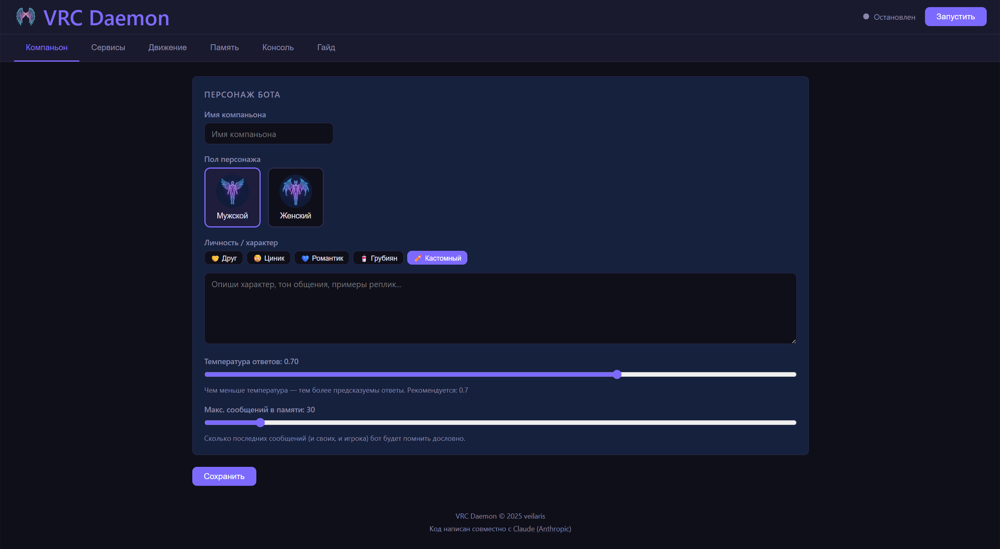
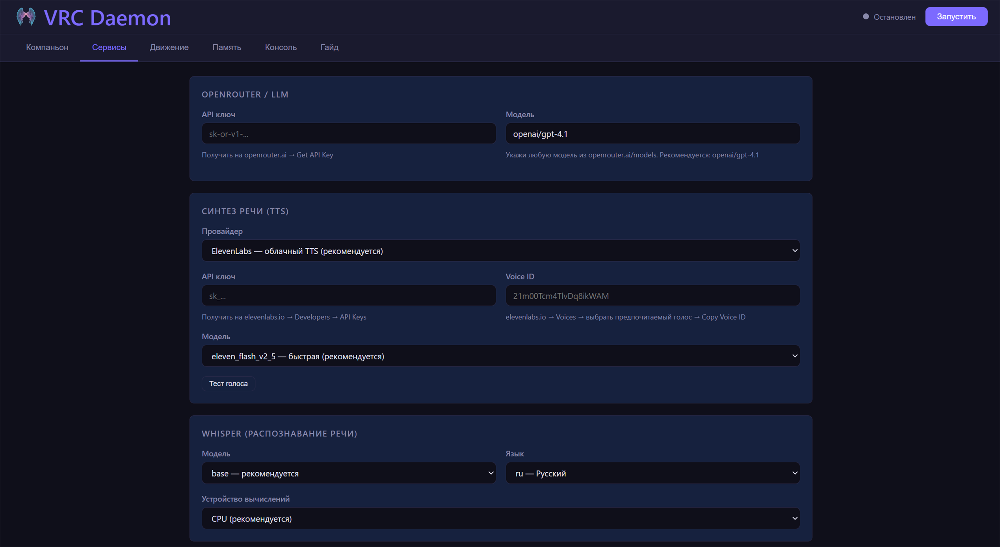
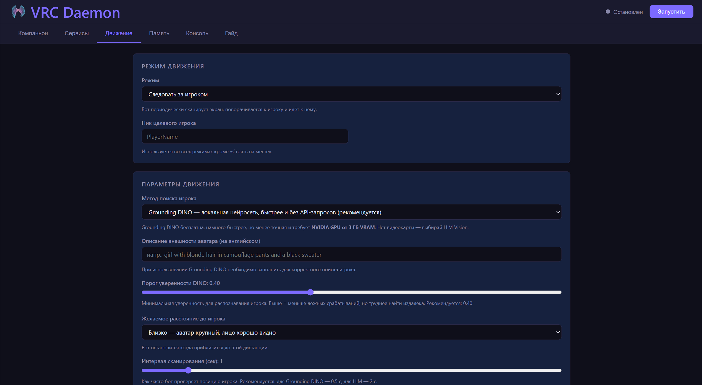
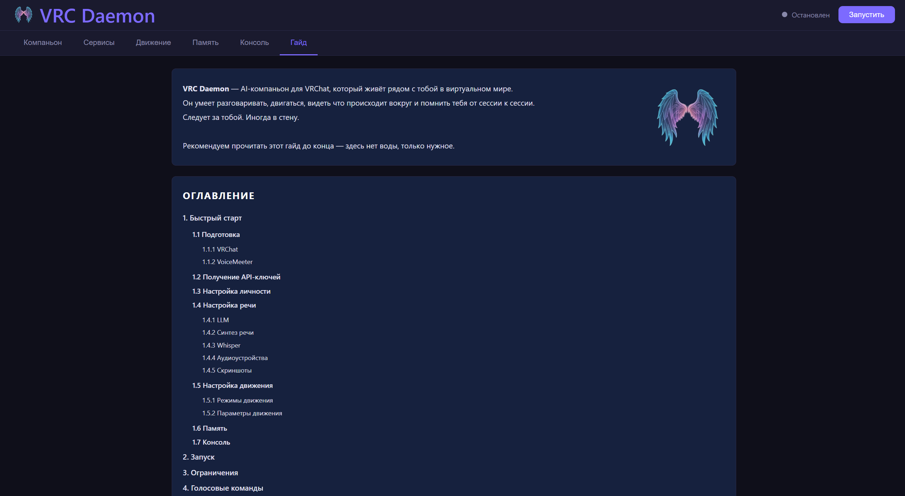

<p align="center">
  
</p>

<h1 align="center">VRC Daemon <sub>v0.1.0</sub></h1>

<p align="center">
  VRC Daemon — AI-компаньон для VRChat, который живёт рядом с тобой в виртуальном мире.<br>
  Он умеет разговаривать, двигаться, видеть что происходит вокруг и помнить тебя от сессии к сессии.<br>
  <em>Следует за тобой. Иногда в стену.</em>
</p>

---

<p align="center">
  
  
</p>
<p align="center">
  
  
</p>

---

## Возможности

- **Голосовой диалог** — распознаёт речь (Whisper), отвечает через LLM (OpenRouter), озвучивает ответ (XTTS / ElevenLabs)
- **Следование за игроком** — управляет аватаром через VRChat OSC (ходьба, повороты, прыжки)
- **Обнаружение объектов** — находит порталы и двери по голосовой команде
- **Голосовые команды** — мгновенные действия без обращения к LLM
- **Память и саммаризация** — после каждой сессии сохраняет краткое резюме, вспоминает его при следующем запуске
- **Веб-интерфейс** — все настройки через браузер

---

## Требования

- Windows 10/11
- Python 3.10+
- VRChat с включённым OSC (`Settings → OSC → Enable`)
- Аватар с поддержкой OSC-движения
- API ключ [OpenRouter](https://openrouter.ai) (LLM + vision)
- TTS: API ключ [ElevenLabs](https://elevenlabs.io) **или** локальный [XTTS API Server](https://github.com/daswer123/xtts-api-server)
- [VoiceMeeter Banana](https://vb-audio.com/Voicemeeter/banana.htm) для аудиороутинга
- **GPU:** NVIDIA с поддержкой CUDA (от 3 ГБ VRAM) — для Grounding DINO. Без видеокарты работает через LLM Vision.

---

## Установка

```bash
git clone https://github.com/veilaris/VRC_Daemon
cd "VRC Daemon"
pip install -r requirements.txt
copy config.example.json config.json
python main.py
```

Открой браузер: **http://localhost:8080**

> **Grounding DINO (опционально, только NVIDIA GPU):**
> ```bash
> pip install torch torchvision --index-url https://download.pytorch.org/whl/cu128
> pip install groundingdino-py
> ```

> **Подробный гайд по настройке находится прямо в приложении** — открой `http://localhost:8080` и перейди на вкладку **«Гайд»**.

---

## Аудиороутинг (VoiceMeeter Banana)

VoiceMeeter нужен чтобы бот слышал звук VRChat и говорил в микрофон VRChat.

**VoiceMeeter Banana:**
- Канал `Voicemeeter Input` → включи **B1**
- Канал `Voicemeeter AUX Input` → включи **B2**

**VRChat** (ПКМ на иконке звука → Микшер громкости → VRChat.exe):
- Устройство вывода → `Voicemeeter Input (VB-Audio Voicemeeter VAIO)`
- Устройство ввода → `Voicemeeter Out B2 (VB-Audio Voicemeeter VAIO)`

**Бот** (вкладка «Сервисы» → Аудио):
- Вход → `Voicemeeter Out B1` (бот слышит игрока)
- Выход → `Voicemeeter AUX Input` (голос бота → VRChat)

---

## Голосовые команды

Выполняются мгновенно, без обращения к LLM:

| Команда | Действие |
|---------|----------|
| развернись / разворот / не туда | Поворот на 180° |
| портал / зайди в портал | Найти и войти в ближайший портал |
| открой дверь / открой / войди | Найти и открыть дверь |
| смотри прямо / смотри вперёд | Сбросить камеру в горизонталь |
| прыгни / прыжок | Прыгнуть |
| иди за мной / следуй за мной | Режим «Следовать за игроком» |
| стой / стоп / замри | Остановиться |
| смотри на меня / повернись ко мне | Режим «Смотреть на игрока» |

> Команды распознаются в составе фразы: «Эй, развернись!» — сработает.

---

## Grounding DINO (опционально)

Локальная нейросеть для обнаружения игрока и порталов на скриншоте. Бесплатна, работает намного быстрее, но менее точная и требует NVIDIA GPU.

```bash
pip install torch torchvision --index-url https://download.pytorch.org/whl/cu128
pip install groundingdino-py
```

Первый запуск автоматически скачает веса (~700 МБ).

> Без DINO трекер движения и команда «портал» работают через LLM Vision. Команда «дверь» работает всегда — она ищет синий контур взаимодействия VRChat напрямую.

---

## Структура проекта

```
vrchat-bot/
├── main.py              — FastAPI сервер + WebSocket
├── config.py            — Управление настройками
├── config.json          — Настройки
├── overlay.py           — Оверлей с сеткой для LLM-трекера движения
├── requirements.txt
├── modules/
│   ├── audio.py         — Захват звука + VAD
│   ├── stt.py           — Whisper (речь → текст)
│   ├── llm.py           — OpenRouter LLM клиент
│   ├── tts.py           — XTTS / ElevenLabs + кэш
│   ├── osc.py           — VRChat OSC контроллер
│   ├── vision.py        — Скриншоты + Grounding DINO
│   ├── movement.py      — Контроллер движения
│   ├── commands.py      — Голосовые команды и реплики
│   ├── memory.py        — История диалога
│   └── bot.py           — Главный координатор
├── static/
│   ├── index.html       — Веб-интерфейс
│   └── app.js           — Фронтенд
└── data/
    ├── memory.json           — История текущей сессии
    ├── long_term_memory.txt  — Саммари прошлых сессий
    ├── tts_cache/            — Кэш TTS-аудио
    └── voice_samples/        — WAV-образцы голоса для XTTS
```

---

## Технологии

| Компонент | Технология |
|-----------|-----------|
| Веб-сервер | FastAPI + uvicorn |
| STT | faster-whisper |
| LLM + Vision | OpenRouter API |
| TTS | XTTS API Server / ElevenLabs |
| Движение | python-osc → VRChat OSC |
| Захват аудио | sounddevice + RMS VAD |
| Скриншоты | mss + Pillow |
| Обнаружение объектов | Grounding DINO (опционально) |
| Виртуальное аудио | VoiceMeeter Banana |

---

## Авторы

Сделано [veilaris](https://github.com/veilaris) при содействии [Claude](https://claude.ai) (Anthropic).
